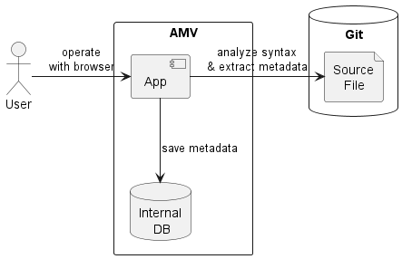

# Application Metadata Visualizer

[English](README_ja.md)

Application Metadata Visualizer(AMV)は、Gitリポジトリ内のJavaアプリケーションのソースコードを構文解析してメタデータを抽出し、アプリケーション内部の処理を可視化します。



## 使用方法

### 必要なソフトウェア

AMVを使用するにはDockerが必要です。

### 実行手順

1. 以下のコマンドを実行します。

```sh
# Windows (Command Prompt)
docker run -d --name amv -p 8080:8080 -v %USERPROFILE%/.m2:/home/jboss/.m2 projectaulait/amv

# Windows (PowerShell)
docker run -d --name amv -p 8080:8080 -v ${HOME}/.m2:/home/jboss/.m2 projectaulait/amv

# Mac / Linux
docker run -d --name amv -p 8080:8080 -v ~/.m2:/home/jboss/.m2 projectaulait/amv
```

2. ブラウザで http://localhost:8080 を開きます。
3. 可視化したいGitリポジトリを登録し、解析を実行します。

#### 補足

- **`.m2`ディレクトリをマウントする理由**
  解析対象のGitリポジトリがMavenプロジェクトである場合、AMVはMavenビルド(`mvn package dependency:build-classpath`)を実行します。Mavenビルドではプロジェクトの依存ライブラリがダウンロードされますが、ホスト上の`.m2`ディレクトリをマウントすることで、このダウンロードにかかる時間を短縮できる可能性があります。
  解析対象がGradleプロジェクトの場合は、同様の理由でユーザーホーム以下の`.gradle/caches`をマウントしてください。
- **VPN経由でGitリポジトリにアクセスする場合**
  解析対象のGitリポジトリのクローンにVPN接続が必要な場合は、以下の手順で解析してください。
  1. ホストPC上にミラーリポジトリとしてクローン
  2. AMV実行時にクローンしたミラーリポジトリをマウント
  3. マウントされたGitリポジトリのコンテナ内のパスをAMVに登録して解析

  **例**
  ```sh
  # ⅰ
  git clone --mirror https://server/myrepo.git

  docker run -v ./:/mnt/amv [以降　実行手順のdockerコマンドと同じ]
  ```

  上記の例ではAMVに登録するパスは`/mnt/amv/myrepo.git`となります。

- **ログの出力先**
  AMVのログは以下に出力されます。
  - コンテナの標準出力  (INFOレベル)
  - コンテナ内のログファイル `/deployments/logs/amv.log` (DEBUGレベル)

## ソースコードをビルドして使用

### 必要なソフトウェア

AMVをソースコードからビルドして実行するには以下のソフトウェアが必要です。

- Git
- Docker
- Java v21+
- Node.js v22+
- pnpm
- VSCode

### ビルド

1. 以下のコマンドを実行します。

```sh
git clone https://github.com/project-au-lait/amv.git
cd amv

# H2 mode
./mvnw install -P setup -T 1C

# PostgreSQL mode
export AMV_DB=postgres
./mvnw install -P setup -T 1C
```

### 動作確認

1. VSCode Task `start-backend`, `start-frontend` を実行します。
2. 表示されたブラウザで以下の操作を実行します。
   1. `デモ用コードベースの登録`
   2. `登録`
   3. `解析`
